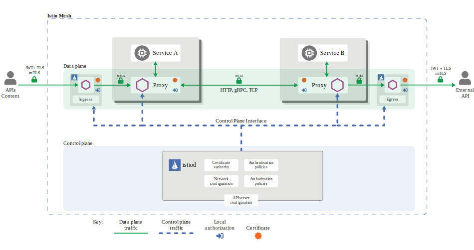

# Security

Service Mesh consente di crittografare tutto il traffico senza richiedere modifiche al codice, senza complicati aggiornamenti di rete e senza installare/utilizzare strumenti esterni.

Per impostazione predefinita, mTLS in OpenShift Service Mesh viene abilitato e impostato Permissive Mode, i sidecar in Service Mesh accettano sia il traffico in plain text sia le connessioni crittografate tramite mTLS.

Abilitando mTLS nella mesh a livello di Control Plane (ServiceMeshControlPlane) è possibile proteggere i namespace dichiarati nella mesh. Per personalizzare le connessioni di crittografia del traffico i namespace devono essere configurati con le risorse PeerAuthentication e DestinationRule.



La CA di Istio genera automaticamente certificati per supportare le connessioni mTLS e li inietta nei pod dell'applicazione. In questo caso, l'utilizzo di mTLS comporta un ulteriore vantaggio poiché consente agli amministratori di creare regole di controllo degli accessi basate sui ruoli (RBAC) nel cluster OpenShift per specificare quale client può connettersi a quali servizi.

## Abilitare mTLS

```yaml
apiVersion: maistra.io/v2
kind: ServiceMeshControlPlane
spec:
  security:
    dataPlane:
      mtls: true
```

WARNING: Il passaggio alla modalità Enforce è facilmente attuabile se i workload non necessitano di comunicare con risorse esterne, perchè il traffico in egress dagli envoy viaggia cifrato.

### Verifica mTLS status

La console Kiali offre diversi modi per verificare se le applicazioni, i servizi e i carichi di lavoro hanno la crittografia mTLS abilitata o meno.


Sul lato destro del masthead, Kiali mostra un'icona a forma di lucchetto quando la mesh ha abilitato rigorosamente mTLS per l'intera service mesh. Ciò significa che tutte le comunicazioni nella mesh utilizzano mTLS.


Kiali visualizza un'icona a forma di lucchetto vuoto quando la mesh è configurata in PERMISSIVEmodalità o si verifica un errore nella configurazione mTLS dell'intera mesh.

## Configurazione TLS Gateway

Per esporre un gateway in https è sufficiente aggiungere all'interno della sua configurazione la sezione TLS con riferimento alla secret contenente certificato e chiave:

```yaml
apiVersion: networking.istio.io/v1beta1
kind: Gateway
  name: bookinfo-gateway
  namespace: bookinfo
spec:
  selector:
    istio: ingressgateway
  servers:
    - hosts:
        - bookinfo.apps.lab.dpastore.uk
      port:
        name: https
        number: 443
        protocol: HTTPS
      tls:
        credentialName: bookinfo-credential
        mode: SIMPLE
```

## Controllo outBound

Istio ha un'opzione che consente di configurare i sidecar per abilitare o bloccare connessioni verso servizi esterni, ovvero quei servizi che non sono definiti nel registro della mesh. Di default questa opzione è impostata su ALLOW_ANY, il proxy Istio infatti lascia passare le chiamate a servizi sconosciuti. Se l'opzione è impostata su REGISTRY_ONLY, il proxy Istio blocca qualsiasi host senza un servizio HTTP o una voce di servizio definita all'interno della mesh.

Per il passaggio alla modalità REGISTRY_ONLY aggiungere in ServiceMeshControlPlane:

```yaml
spec:
   proxy:
     networking:
       trafficControl:
         outbound:
           policy: REGISTRY_ONLY
```

Definire un ServiceEntry per abilitare l'outbound verso un servizio esterno:

```yaml
apiVersion: networking.istio.io/v1alpha3
kind: ServiceEntry
metadata:
  name: ext-httpbin
  namespace: bookinfo
spec:
  hosts:
    - httpbin.org
  location: MESH_EXTERNAL
  ports:
    - name: https
      number: 443
      protocol: HTTPS
  resolution: DNS
```
